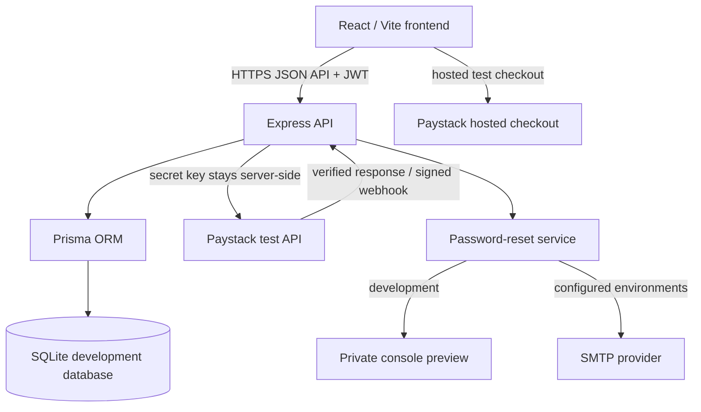
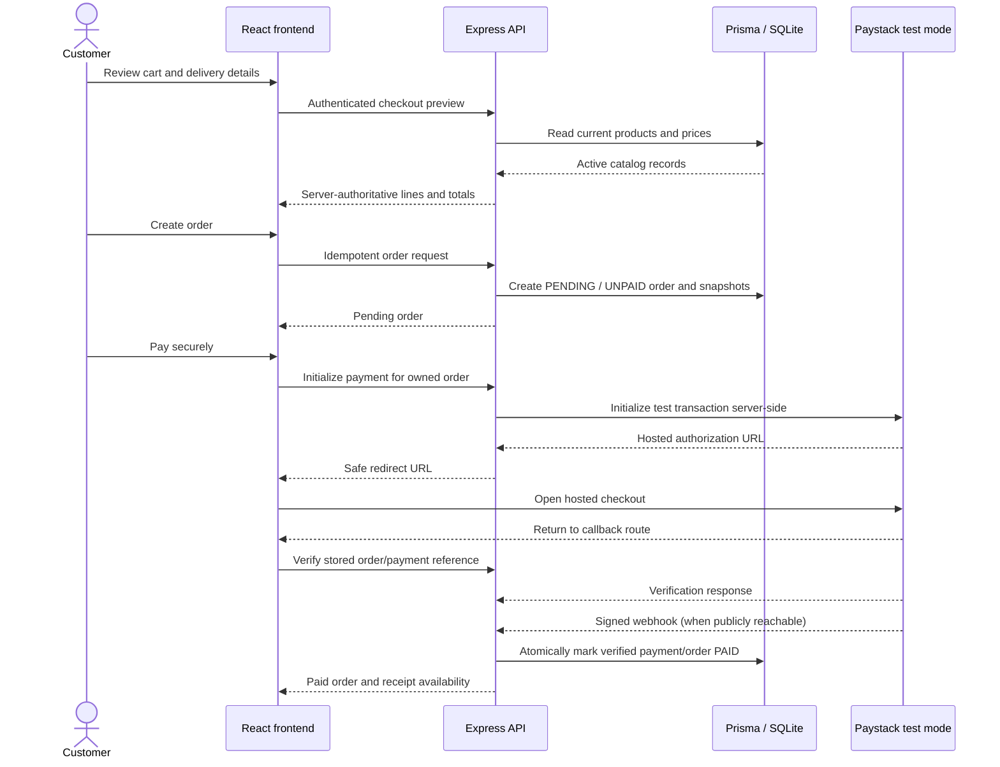

# ShopSphare

ShopSphare is a full-stack portfolio e-commerce application built with React, Express, Prisma, and SQLite. It demonstrates a complete customer journey: browsing a responsive product catalog, secure authentication and password recovery, a persistent cart, server-authoritative checkout, Paystack test payments, order history, order details, and printable paid receipts.

**Naming:** ShopSphare is the software project and repository. **OfferingsbyMK** is the demonstration storefront customers see inside the application.

## Screenshots

Genuine screenshots have not yet been added because browser capture was unavailable during the presentation phase. No mock or AI-generated application images are used.

Before publishing the portfolio, capture development/test-data views of:

- Home and Shop on desktop;
- mobile navigation and the empty/non-empty cart;
- checkout review without personal delivery information;
- My Orders, a paid order, and a receipt with identifying values masked;
- Login and password recovery.

Store approved captures in `docs/screenshots/` and add them here with descriptive alternative text. Check desktop, tablet, and mobile layouts; light and dark modes; keyboard focus; reduced-motion carousel behavior; image loading; and the Console/Network panels before publishing.

## Features

- Responsive Home, Shop, category, and product-detail experiences for 29 catalog products
- Persistent cart with quantity limits and clear-cart confirmation
- Registration, login, logout, session restoration, and protected-route destination preservation
- Enumeration-resistant forgot-password flow and secure single-use password-reset tokens
- Authenticated delivery details and checkout review
- Server-authoritative prices, availability, currency, and totals
- Idempotent pending-order creation with immutable order-item snapshots
- Server-side Paystack test-mode initialization, callback verification, and signed webhook handling
- Pending, successful, declined, and cancelled payment states
- My Orders, reusable order details, and printable paid receipts
- Responsive WebP/fallback image delivery, intrinsic dimensions, deliberate loading priority, and route-level code splitting
- Accessible form labels, validation relationships, status announcements, keyboard controls, and reduced-motion-aware carousels
- Automated frontend component/unit tests and isolated backend integration tests

## Customer journey

1. Browse the OfferingsbyMK Home or Shop catalog and open a product.
2. Add products to the persistent cart and continue to checkout.
3. Register or log in; a protected destination is preserved across authentication.
4. Enter delivery details and review server-verified lines and totals.
5. Create a pending order, then initialize a Paystack **test-mode** payment.
6. Complete hosted checkout; the backend verifies the callback or a signed webhook.
7. Review the result in My Orders and print a receipt after verified payment.
8. Return later and restore the authenticated session through the backend `/me` check.

## Technology stack

| Layer | Technology |
|---|---|
| Frontend | React 18, Vite, React Router, Redux Toolkit, Tailwind CSS, Swiper |
| API | Node.js, Express, Zod, Helmet, rate limiting |
| Data | Prisma ORM, SQLite for local/single-instance portfolio use |
| Authentication | bcrypt password hashing, signed JWTs with auth-version invalidation |
| Payments | Paystack hosted checkout in test mode |
| Email | Nodemailer SMTP or a local preview mode |
| Testing | Vitest, Testing Library, Node test runner, Supertest |
| Images | Sharp-generated responsive fallbacks and WebP candidates |

## Architecture



The frontend never accesses Prisma, SQLite, Paystack secret keys, or SMTP credentials. The shared catalog keeps canonical product IDs and commerce fields aligned between UI data and backend synchronization.

### Checkout and payment sequence



Password recovery follows a separate server-owned flow: a generic request response prevents account enumeration, only a token hash is stored, preview or SMTP delivery occurs server-side, successful consumption invalidates older sessions, and the customer must log in with the new password.

## Repository structure

```text
ShopSphare/
├── client/                 React/Vite application, UI tests, responsive assets
│   ├── docs/               Image performance audit
│   ├── scripts/            Deterministic responsive-image generation
│   └── src/                Components, pages, store, API clients, and tests
├── server/                 Express API and isolated integration tests
│   ├── auth/               Password-reset and rate-limit logic
│   ├── commerce/           Catalog, checkout, orders, and payments
│   ├── prisma/             Schema and migration history
│   ├── routes/             HTTP routes
│   └── scripts/            Test runner and catalog synchronization
└── shared/                 Canonical commerce catalog fields
```

## Local setup

### Prerequisites

- A current Node.js LTS release and npm
- A Paystack **test** account only when exercising hosted payment checkout
- Optional SMTP credentials only when testing real email delivery locally

### Install

```bash
cd client
npm install

cd ../server
npm install
```

Create ignored `client/.env` and `server/.env` files from their respective `.env.example` templates. Do not commit environment files or real credentials.

The client template documents `VITE_API_URL`. The server template documents `PORT`, `SECRET`, `DATABASE_URL`, `CORS_ORIGINS`, Paystack settings, application/reset settings, email delivery mode, and SMTP settings. Replace placeholders locally; never place a Paystack secret in a client-side or `VITE_*` variable.

### Database and catalog

From `server/`:

```bash
npm run db:migrate
npm run db:sync-products
```

`db:migrate` applies the checked-in Prisma migration history to the configured database. `db:sync-products` is the verified synchronization script for the categories and products in `shared/commerceCatalog.mjs`; it modifies configured catalog records, so run it deliberately and only against the intended local database.

SQLite is appropriate here for local development and a single-instance portfolio demonstration. It is not presented as the persistence design for a horizontally scaled production service.

### Start the application

Run each process in its own terminal:

```bash
# server/
npm run dev
```

```bash
# client/
npm run dev
```

The checked-in Vite configuration serves the frontend on port 5174. The server address and allowed frontend origin come from local environment configuration.

## Paystack test mode

Only Paystack keys beginning with the test-key prefix are accepted; live configuration is refused. Set the server-side Paystack variables from `server/.env.example`, keep the secret out of the frontend, and use Paystack's published test scenarios. The callback must target `/payments/paystack/callback` on the frontend. Real webhook delivery requires a publicly reachable HTTPS backend; localhost normally cannot receive it.

See [server/PAYMENTS.md](server/PAYMENTS.md) for the implemented states, validation rules, webhook path, and official Paystack references. Never use real money or live keys for this portfolio demo.

## Password-reset preview mode

For local development, select the preview email delivery mode in the server environment. A reset request then writes a masked recipient and the one-time reset message to the private server console instead of contacting SMTP. Treat that console output as sensitive: do not publish, copy into screenshots, or share its reset URL.

To exercise SMTP, configure the documented SMTP variables and explicitly select SMTP mode. The browser never receives SMTP credentials, and public forgot-password responses remain generic regardless of account or delivery state.

## Tests and validation

```bash
# client/ — reliable full-suite configuration
npm test -- --maxWorkers=1
npm run build
```

```bash
# server/ — creates, migrates, tests, and removes an isolated test.db
npm test
npm run validate
```

The backend test runner fingerprints `server/prisma/dev.db` before and after its isolated suite and fails if the development database changes. Dependency review can be run separately in each package with `npm audit`.

Responsive image generation is deterministic and optional unless source imagery changes:

```bash
# client/
npm run images:generate
```

The generator uses layout-derived widths, avoids upscaling, preserves originals, and writes generated assets only under `client/src/assets/images/optimized/`.

## Security decisions

- Passwords are bcrypt-hashed; reset tokens are random, hashed at rest, expiring, supersedable, and single-use.
- Successful password reset increments the user's auth version, invalidating older JWTs and clearing client authentication state only after success.
- Forgot/reset errors do not disclose whether an account or token state exists.
- Checkout totals, availability, currency, order ownership, and payment completion are enforced by the server.
- Paystack secrets remain server-side; test-domain, amount, currency, metadata, customer, and stored references are verified.
- Signed webhook validation uses the exact request body, and paid records are not downgraded.
- Helmet, CORS allow-listing, request validation, authentication middleware, and scoped rate limits protect exposed routes.

## Accessibility

- Persistent visible authentication labels and appropriate names, types, autocomplete values, required state, and error relationships
- Semantic password visibility and Login/Signup switching buttons with visible focus indicators
- Announced validation, loading, error, and success states with duplicate-submit prevention
- Carousel autoplay is disabled when reduced motion is requested and is not resumed automatically
- Autoplay disabled when reduced motion is initially requested and never automatically resumed after a reduced-motion change
- Meaningful product alternative text, decorative empty alternatives, intrinsic image dimensions, semantic headings, and protected focus flows

Code-level behavior is covered by component tests. Manual keyboard, screen-reader, contrast, and reduced-motion checks are still required in real browsers before publication.

## Performance

The image phase converted selected delivery candidates to responsive fallback/WebP sets and added native lazy loading, explicit dimensions, async decoding, and deliberate LCP priority. Static results recorded in [the image audit](client/docs/image-performance-audit.md):

- 41 selected originals: **76.51 MiB**
- 174 generated responsive files: **4.72 MiB**, a **93.8%** reduction versus those selected originals
- baseline monolithic JavaScript: **971.43 kB**; the current main entry is **295.08 kB** (**91.86 kB gzip**), while Login is isolated as a **428.07 kB** route chunk (**102.04 kB gzip**)

These are static build/file measurements, not live Core Web Vitals. No LCP, CLS, FCP, TBT, or transferred-byte claim is made without a real browser trace.

## Safe demo guidance

There are no published demo credentials. Register a new development account, use non-personal test delivery data, and use Paystack's official test mode only. Do not place real customer information, payment references, password-reset URLs, or environment values in screenshots or issue reports.

## Known portfolio limitations

- No public deployment is currently documented.
- SQLite targets local/single-instance demonstration rather than production scale.
- Payments are test mode only; refunds, reconciliation jobs, analytics, and live payments are out of scope.
- There is no admin dashboard, inventory/fulfilment management, search, browser E2E suite, or CI pipeline yet.
- Transactional email requires local preview mode or separately configured SMTP.
- Some preserved original and public assets are intentionally unused pending an explicit cleanup decision.
- Genuine portfolio screenshots and real assistive-technology/browser verification remain to be completed.

## Production-hardening roadmap

Before treating the project as a real store: deploy behind HTTPS; move persistence to managed PostgreSQL with backups; configure restricted secrets, CORS, SMTP, and public webhooks; add browser E2E/CI coverage; define inventory and fulfilment concurrency rules; add monitoring, reconciliation, privacy/legal policies, operational admin authorization, and tested refund/support processes.

## Deployment and license

No production deployment URL is currently provided. The repository does not currently declare a license; no reuse rights should be assumed until the owner selects one.
